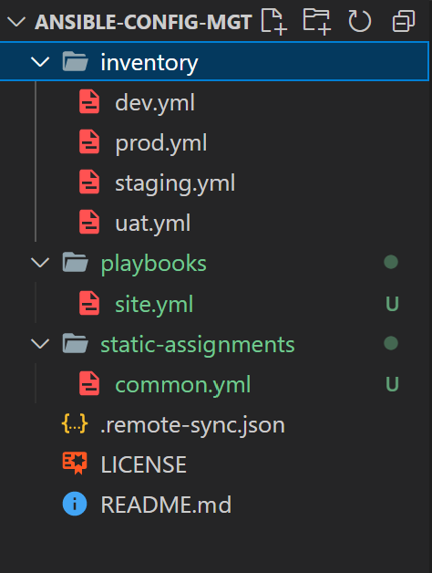

# Step 1 – Jenkins House Cleaning

Create a directory in the Jenkins server to to reduce space and streamline for every build or code change that happens on the job.

Go to your Jenkins-Ansible server and create a new directory called `ansible-config-artifact` – we will store there all artifacts after each build.

```bash
sudo mkdir /home/ubuntu/ansible-config-artifact

#Change permissions to this directory, so Jenkins could save files there

sudo chmod -R 0777 /home/ubuntu/ansible-config-artifact
```


Go to Jenkins web console -> Manage Jenkins -> Manage Plugins -> on Available tab search for `Copy Artifact` and install this plugin without restarting Jenkins


Now create a `new Freestyle` project job called `save_artifacts`.

Configure the project to be triggered by completion of your existing ansible project `Ansible`. Configure it accordingly:


>The number of builds kept is varies according to your needs.

The main idea of `save_artifacts` project is to save artifacts into `/home/ubuntu/ansible-config-artifact` directory. To achieve this, create a `Build step` and choose `Copy artifacts from other project`, specify ansible as a source project and `/home/ubuntu/ansible-config-artifact` as a target directory. Apply and save configuration.


Test your set up by making some change in `README.MD` file inside your `ansible-config-mgt` repository


The Jenkins Job completed successfully. Now the Jenkins pipeline is more neat and clean.


## REFACTOR ANSIBLE CODE BY IMPORTING OTHER PLAYBOOKS INTO SITE.YML

Let's Refactor Ansible code by importing other playbooks into site.yml

> Create a new branch to work from called `refactor`


Within playbooks folder, create a new file and name it `site.yml` – This file will now be considered as an entry point into the entire infrastructure configuration. Other playbooks will be included here as a reference. In other words, `site.yml` will become a parent to all other playbooks that will be developed.


Let's orangnize the workspace better, Create a new fold called `static-assignments` Move `common.yml` file into the newly `created static-assignments` folder. The folder and file tree should look like this now *( see image below )*



Run ansible-playbook command against the `dev` environment. Create another playbook in `static-assignments` called `common-del.yml` to configure the deletion of wireshark utility which was previously installed on the servers.

The folders, files and code should look as shown below.

`site.yml`


`common-del.yml`


>Update, commit and push code to origin refactor to initiate a pull request that trigger the webhook for a new build.

Verify dynamic build in Jenkins


Run ansible playbook


Verify wireshark utility was deleted successfully. Login into any of the servers, in this case - the NFS server to verify.

```bash
wireshark --version
```


## CONFIGURE UAT WEBSERVERS WITH A ROLE ‘WEBSERVER’

Launch 2 fresh EC2 instances using RHEL 8 image, we will use them as our uat servers, so give them names accordingly – `Web1-UAT` and `Web2-UAT`.


To create a role, you must create a directory called `webserver/`, relative to the playbook file or in `/etc/ansible/` directory.

Create a roles directory within, also create some child folders and files manually.

>Alternatively, this can generated automatically by creating a roles directory byfront and running `ansible-galaxy init webserver` in the roles directory.


Update the inventory `ansible-config-mgt/inventory/uat.yml` file with IP addresses of your 2 UAT Web servers.


In `/etc/ansible/ansible.cfg` file uncomment `roles_path` string and provide a full path to your roles directory roles_path    = `/home/ubuntu/ansible-config-mgt/roles`, so Ansible could know where to find configured roles. save and exit.

```bash
sudo vi /etc/ansible/ansible.cfg
```


Also add the private_key


Go into tasks directory, and within the main.yml file, start writing configuration tasks to do the following:

- Install and configure Apache (httpd service)

- Clone Tooling website from GitHub https://github.com/oayanda/tooling.git.

- Ensure the tooling website code is deployed to /var/www/html on each of 2 UAT Web servers.

- Make sure httpd service is started

```bash
---
- name: install apache
  become: true
  ansible.builtin.yum:
    name: "httpd"
    state: present

- name: install git
  become: true
  ansible.builtin.yum:
    name: "git"
    state: present

- name: clone a repo
  become: true
  ansible.builtin.git:
    repo: https://github.com/<your-name>/tooling.git
    dest: /var/www/html
    force: yes

- name: copy html content to one level up
  become: true
  command: cp -r /var/www/html/html/ /var/www/

- name: Start service httpd, if not started
  become: true
  ansible.builtin.service:
    name: httpd
    state: started

- name: recursively remove /var/www/html/html/ directory
  become: true
  ansible.builtin.file:
    path: /var/www/html/html
    state: absent

```


## Reference ‘Webserver’ role

Within the `static-assignments` folder, create a new assignment for uat-webservers called `uat-webservers.yml`. This is where you will reference the role.

```bash
---
- hosts: uat-webservers
  roles:
     - webserver

```


> Remember that the entry point to our ansible configuration is the `site.yml` file. Therefore, you need to refer your `uat-webservers.yml` role inside `site.yml`.

Update `site.yml`. *Comment the previous play since it is not applicable*.

```bash
---
- hosts: uat-webservers
- import_playbook: ../static-assignments/uat-webservers.yml
```


## Commit & Test

Commit the changes, create a Pull Request and merge them to master branch


Verify build on Jenkins `Anisble job`


Verify build on Jenkins `save_artifacts`


Run Playbook

```bash
#Run the build in the build directory
sudo ansible-playbook -i inventory/uat.yml playbooks/site.yml
```


In other to view the web application in the browser, open port 80 for http traffic in the security group


View the web application in the browser

