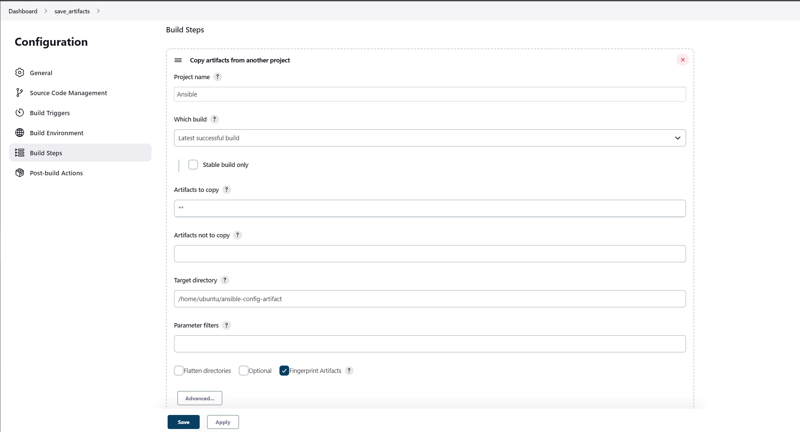

# Step 1 – Jenkins job enhancement

Create a directory in the Jenkins server to to reduce space and streamline for every build or code change that happens on the job.

Go to your Jenkins-Ansible server and create a new directory called `ansible-config-artifact` – we will store there all artifacts after each build.

```bash
sudo mkdir /home/ubuntu/ansible-config-artifact

#Change permissions to this directory, so Jenkins could save files there

sudo chmod -R 0777 /home/ubuntu/ansible-config-artifact
```


Go to Jenkins web console -> Manage Jenkins -> Manage Plugins -> on Available tab search for `Copy Artifact` and install this plugin without restarting Jenkins


Now create a `new Freestyle` project job called `save_artifacts`.

Configure the project to be triggered by completion of your existing ansible project `Ansible`. Configure it accordingly:


>The number of builds kept is varies according to your needs.

The main idea of `save_artifacts` project is to save artifacts into `/home/ubuntu/ansible-config-artifact` directory. To achieve this, create a `Build step` and choose `Copy artifacts from other project`, specify ansible as a source project and `/home/ubuntu/ansible-config-artifact` as a target directory. Apply and save configuration.



Test your set up by making some change in `README.MD` file inside your `ansible-config-mgt` repository